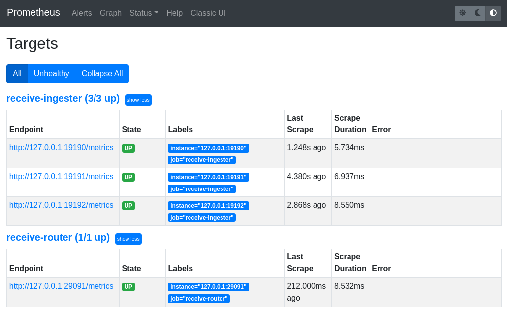
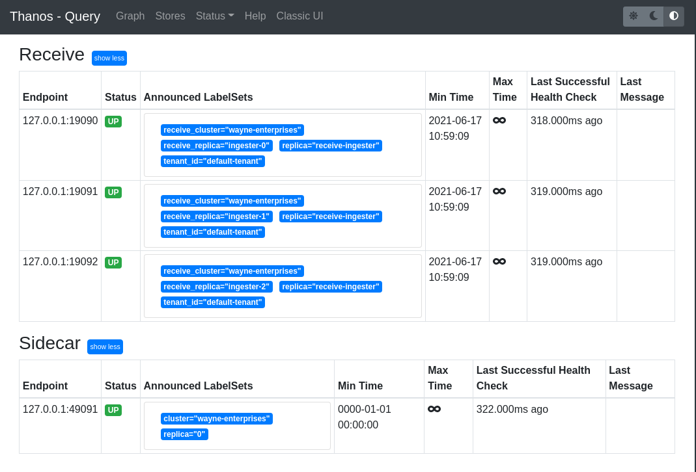

## Infrastructure

In the last page, we discussed how configuring a `Thanos` receive architecture with **separate** `routing` and `ingesting` components can increase the stability and availability of our architecture during reconfiguration and scaling periods.

With that in mind, we will now build this architecture 💪

// TODO - Insert diagram of the architecture we are building here.]


### Thanos Receive - Ingester

The first thing we will setup is the `ingesting` components. Since their only job is to accept metrics data from `routing` components, their configuration is relatively simple.

Let's spin up 3 `ingesting` components.

```
docker run  -d --rm \
  -v $(pwd)/receive-ingest-0-data:/receive/data \
  --net=host \
  --name receive-ingest-0 \
  quay.io/thanos/thanos:main-2021-06-11-7c6c5051 \
  receive \
  --tsdb.path "/receive/data" \
  --grpc-address 127.0.0.1:19090 \
  --http-address 127.0.0.1:19190 \
  --label "replica=\"receive-ingester\"" \
  --label "receive_replica=\"ingester-0\"" \
  --label "receive_cluster=\"wayne-enterprises\"" \
  --remote-write.address=127.0.0.1:19290
```{{execute}}

```
docker run -d --rm \
  -v $(pwd)/receive-ingest-1-data:/receive/data \
  --net=host \
  --name receive-ingest-1 \
  quay.io/thanos/thanos:main-2021-06-11-7c6c5051 \
  receive \
  --tsdb.path "/receive/data" \
  --grpc-address 127.0.0.1:19091 \
  --http-address 127.0.0.1:19191 \
  --label "replica=\"receive-ingester\"" \
  --label "receive_replica=\"ingester-1\"" \
  --label "receive_cluster=\"wayne-enterprises\"" \
  --remote-write.address=127.0.0.1:19291
```{{execute}}

```
docker run  -d --rm \
  -v $(pwd)/receive-ingest-2-data:/receive/data \
  --net=host \
  --name receive-ingest-2 \
  quay.io/thanos/thanos:main-2021-06-11-7c6c5051 \
  receive \
  --tsdb.path "/receive/data" \
  --grpc-address 127.0.0.1:19092 \
  --http-address 127.0.0.1:19192 \
  --label "replica=\"receive-ingester\"" \
  --label "receive_replica=\"ingester-2\"" \
  --label "receive_cluster=\"wayne-enterprises\"" \
  --remote-write.address=127.0.0.1:19292
```{{execute}}

<details>
    <summary>Do we need to specify remote-write.address for ingesting components?</summary>
    
    No. To run in `ingester` mode we don't need to specify the `remote-write.address` flag. 
    
    We need to do this here because of the limitations of this Katacoda environment.

</details>

`Thanos Receive` does not expose a UI, so let's verify this is running successfully by `curl`-ing the metrics endpoints, and checking that we get `200` responses from each.

```
curl --write-out '%{http_code}\n' --silent --output /dev/null 127.0.0.1:19190/metrics
curl --write-out '%{http_code}\n' --silent --output /dev/null 127.0.0.1:19191/metrics
curl --write-out '%{http_code}\n' --silent --output /dev/null 127.0.0.1:19192/metrics
```{{execute}}

### Thanos Receive - Router

Next, let's setup our `Thanos Receive` `routing` component.

#### Hashring Configuration 

When configuring our `routing` component(s), we need to tell them about the `ingesting` components. 

We do so via the `hashring.json` file, that contains the `gRPC` endpoints of the components we created above.

<pre class="file" data-filename="hashring.json" data-target="replace">
[
    {
        "endpoints": [
            "127.0.0.1:19090",
            "127.0.0.1:19091",
            "127.0.0.1:19092"
        ]
    }
]
</pre>

#### Data Replication

Since `routing` components decide which `ingesting` components store the metrics data they forward - they are also in charge of performing data replication.

Simply put - we achieve data replication by forwarding our metrics data to >1 downstream ingester. This is controlled via the `--receive.replication-factor` flag.

<details>
  <summary>What values can you set this to be?</summary>

  Since we have 3 endpoints configured in our `hashring.json`, we can configure a maximum replication factor of 3. 
  
  This would mean the incoming data gets replicated to all `ingesting` components.
</details>

Let's put this together and run our `Thanos Receive` - `routing` component.

```
docker run -d --rm \
    -v $(pwd)/editor/hashring.json:/receive/hashring.json \
    --net=host \
    --name receive-router-0 \
    quay.io/thanos/thanos:main-2021-06-11-7c6c5051 \
    receive \
    --receive.hashrings-file=/receive/hashring.json \
    --receive.replication-factor 2 \
    --grpc-address 127.0.0.1:29090 \
    --http-address 127.0.0.1:29091 \
    --label "receive_replica=\"router-0\"" \
    --label "receive_cluster=\"wayne-enterprises\"" \
    --remote-write.address 127.0.0.1:29092
```{{execute}}

`Thanos Receive` does not expose a UI, so let's verify this is running successfully by `curl`-ing the metrics endpoint.

```
curl --write-out '%{http_code}\n' --silent --output /dev/null 127.0.0.1:29091/metrics
```{{execute}}

### Prometheuses

#### Batcave

<pre class="file" data-filename="prometheus-batcave.yaml" data-target="replace">
global:
  scrape_interval: 5s
  external_labels:
    cluster: batcave
    replica: 0

scrape_configs:
  - job_name: 'prometheus'
    static_configs:
      - targets: ['127.0.0.1:39090']
remote_write:
- url: 'http://127.0.0.1:29092/api/v1/receive'
</pre>

```
docker run -d --net=host --rm \
    -v /root/editor/prometheus-batcave.yaml:/etc/prometheus/prometheus.yaml \
    -v /root/prometheus-batcave:/prometheus \
    -u root \
    --name prometheus-batcave \
    quay.io/prometheus/prometheus:v2.27.0 \
    --config.file=/etc/prometheus/prometheus.yaml \
    --storage.tsdb.path=/prometheus \
    --web.listen-address=:39090 \
    --web.external-url=https://[[HOST_SUBDOMAIN]]-39090-[[KATACODA_HOST]].environments.katacoda.com \
    --web.enable-lifecycle
```{{execute}}

Verify this is running successfully by navigating to the `prometheus-batcave` UI - [here](https://[[HOST_SUBDOMAIN]]-39090-[[KATACODA_HOST]].environments.katacoda.com), and check the scraping targets are correctly configure in the `Targets` page.

#### Batcomputer

<pre class="file" data-filename="prometheus-batcomputer.yaml" data-target="replace">
global:
  scrape_interval: 5s
  external_labels:
    cluster: batcomputer
    replica: 0

scrape_configs:
  - job_name: 'prometheus'
    static_configs:
      - targets: ['127.0.0.1:39091']
remote_write:
- url: 'http://127.0.0.1:29092/api/v1/receive'
</pre>

```
docker run -d --net=host --rm \
    -v /root/editor/prometheus-batcomputer.yaml:/etc/prometheus/prometheus.yaml \
    -v /root/prometheus-batcomputer:/prometheus \
    -u root \
    --name prometheus-batcomputer \
    quay.io/prometheus/prometheus:v2.27.0 \
    --config.file=/etc/prometheus/prometheus.yaml \
    --storage.tsdb.path=/prometheus \
    --web.listen-address=:39091 \
    --web.external-url=https://[[HOST_SUBDOMAIN]]-39091-[[KATACODA_HOST]].environments.katacoda.com \
    --web.enable-lifecycle
```{{execute}}

Verify this is running successfully by navigating to the `prometheus-batcomputer` UI - [here](https://[[HOST_SUBDOMAIN]]-39091-[[KATACODA_HOST]].environments.katacoda.com).

#### Wayne Enterprises

Let's also add a Prometheus instance to monitor our the `Thanos Receive` components that are running in our internal `Wayne Enterprises` environment, and check the scraping targets are correctly configure in the `Targets` page.

<pre class="file" data-filename="prometheus-wayne-enterprises.yaml" data-target="replace">
global:
  scrape_interval: 5s
  external_labels:
    cluster: wayne-enterprises
    replica: 0

scrape_configs:
  - job_name: 'receive-router'
    static_configs:
      - targets: ['127.0.0.1:29091']
  - job_name: 'receive-ingester'
    static_configs:
      - targets: ['127.0.0.1:19190','127.0.0.1:19191','127.0.0.1:19192']
</pre>

```
docker run -d --net=host --rm \
    -v /root/editor/prometheus-wayne-enterprises.yaml:/etc/prometheus/prometheus.yaml \
    -v /root/prometheus-wayne-enterprises:/prometheus \
    -u root \
    --name prometheus-wayne-enterprises \
    quay.io/prometheus/prometheus:v2.27.0 \
    --config.file=/etc/prometheus/prometheus.yaml \
    --storage.tsdb.path=/prometheus \
    --web.listen-address=:39092 \
    --web.external-url=https://[[HOST_SUBDOMAIN]]-39092-[[KATACODA_HOST]].environments.katacoda.com \
    --web.enable-lifecycle
```{{execute}}

Verify this Prometheus is running by naviagting to the [UI](https://[[HOST_SUBDOMAIN]]-39092-[[KATACODA_HOST]].environments.katacoda.com).

<details>
  <summary>How would you check that this prometheus is correctly scraping its targets?</summary>

  Navigate to the `Targets` tab in the Prometheus UI - [here](https://[[HOST_SUBDOMAIN]]-39092-[[KATACODA_HOST]].environments.katacoda.com).
  
  All of the targets should say `Up` like this:
  
  

</details>

Finally, to integrate this data source into `Thanos Query` we need to expose a `Store API` that we do so by running a `Thanos Sidecar`

```
docker run -d --net=host --rm \
    -v /root/prometheus-wayne-enterprises:/prometheus \
    --name prometheus-wayne-enterprises-sidecar \
    -u root \
    quay.io/thanos/thanos:main-2021-06-11-7c6c5051 \
    sidecar \
    --tsdb.path /prometheus \
    --http-address 127.0.0.1:49090 \
    --grpc-address 127.0.0.1:49091 \
    --prometheus.url http://127.0.0.1:39092
```{{execute}}

### Thanos Query

Finally, let's tie all of these components together with `Thanos Query` so that we can be a true global view of our entire monitoring infrastructure.

```
docker run -d --rm \
    --net=host \
    --name query \
    quay.io/thanos/thanos:main-2021-06-11-7c6c5051 \
    query \
    --query.replica-label=replica \
    --http-address "0.0.0.0:59090" \
    --store "127.0.0.1:19090" \
    --store "127.0.0.1:19091" \
    --store "127.0.0.1:19092" \
    --store "127.0.0.1:49091"
```{{execute}}

Verify this is running as expected by navigating to the UI - [here](https://[[HOST_SUBDOMAIN]]-59090-[[KATACODA_HOST]].environments.katacoda.com).

<details>
  <summary>Why are we setting the replica-label flag?</summary>

  Since we are duplicating the data that we ingest, we need to tell `Thanos Query` how to de-duplicate it so we don't get duplicate time series in our output data.

</details>

<details>
    <summary>How can we check that our Querier's stores are configured correctly?</summary>
    
    We can check these in the `Stores` tab in the `Thanos Querier` UI - [here](https://[[HOST_SUBDOMAIN]]-59090-[[KATACODA_HOST]].environments.katacoda.com/stores).
    
    We should see `Up` for all 4 stores.
    
    
    
</details>


## Sanity Checks

Let's now check that things are working as we expect.

Firstly - let's check that our `remote_write` data is replicated twice amongst our `ingesting` components.

<details>
  <summary>How would we check this?</summary>

  Firstly, let's navigate to the `Thanos Query` UI.

</details>

Finally, as a bonus question, how do we configure `Thanos Receive` to run in `routing`, `ingesting` and `routing & ingesting` mode?

<details>
  <summary>Click here for the answer</summary>

  The command line parameters passed to `Thanos Receive` determines which functions it performs:


  |  Function |  `--receive.hashrings-file`  | `--receive.local-endpoint`  |
  |---|---|---|
  | Routing |  ❌️  | ❌️  |
  | Ingesting | ✔️  | ❌  |  
  | Routing & Ingesting | ✔️  | ✔️  |

</details>

